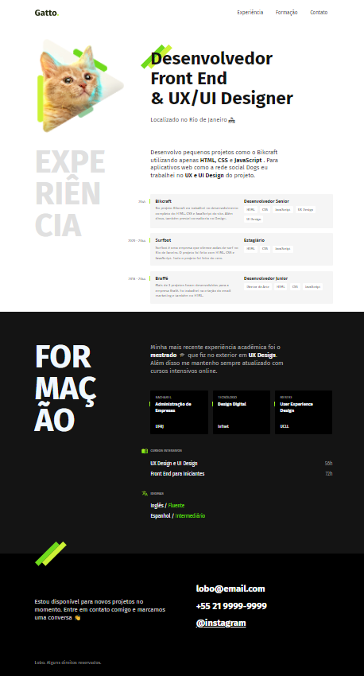

# Origamid - Responsive CV Single Page

This a project from the HTML AND CSS Basics by origamid.com

## Table of contents

- [Overview](#overview)
  - [Screenshot](#screenshot)
  - [Links](#links)
- [My process](#my-process)
  - [Built with](#built-with)
  - [What I learned](#what-i-learned)
  - [Useful resources](#useful-resources)
- [Author](#author)

## Overview

### The challenge

Users should be able to:

- See hover states for interactive elements

### Screenshot

### Links

- Origamid: [https://www.origamid.com/curso/html-e-css-para-iniciantes/]()
- Live Site URL: [https://cat-eight.vercel.app/]()

## My process

### Built with

- Semantic HTML5 markup
- CSS custom properties
- Flexbox
- Responsive Design

### What I learned

I learned how to use the display:grid, the property position absolute and relative, how to apply hover states to the navigation, dispose the grids while the website become mobile using grid: row; and also how to mask the image while stretching the layout with object-fit and object position CSS properties.

### Useful resources

One of the best Front-End courses in available in portuguese(Pt-BR)
https://www.origamid.com/curso/html-e-css-para-iniciantes/

